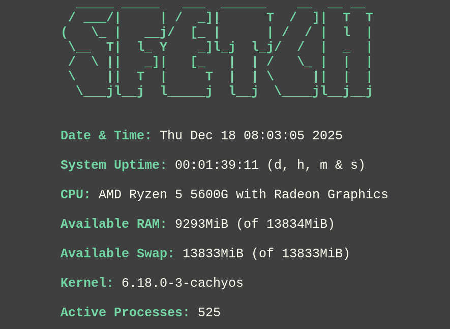
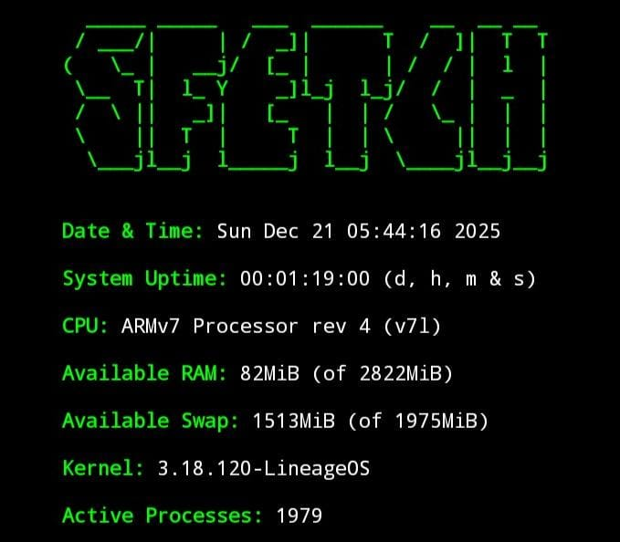

# sfetch

sfetch is a simple, small and fast fetching utility without all the gobbledygook and with a clean and minimal interface. Probably not for visual enthusiasts in its vanilla state.

The vanilla program is as simple as it gets.

Its still in early development (Version 0.1), so no patches are available, yet. 

Patches can be written and pushed to the repo, you're even encouraged to do so.

Theres also still some minor work to do for the vanilla program, please refer to the TODO.md for further information.

# Build requirements

- Linux system with glibc
- gcc/clang or tcc
- glibc dev headers:  
    • Debian/Ubuntu:  sudo apt install libc6-dev 
    • Fedora/Red Hat: sudo dnf install glibc-devel 
    • Arch:           sudo pacman -S glibc

# Usage:

Running the program after compilation: 

    ./sfetch -i 

Show program version after compilation:

    ./sfetch -v 

Directly running the program without compilation/installation with "run.sh" inside the "installation folder" (tcc required):

    ./run.sh 

The program is customizable over its config.h.

# Examples:

sfetch on CachyOS: 

sfetch on Android over Termux: 

